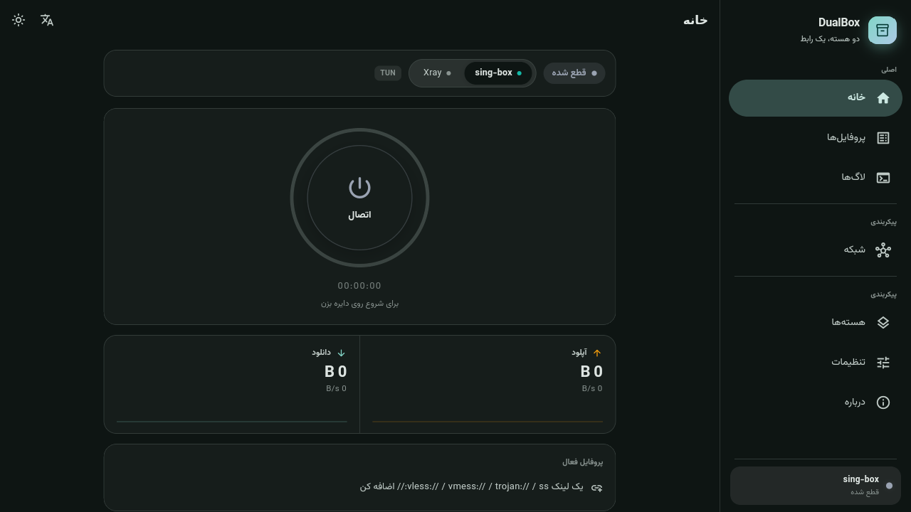

# OVERX

یک رابط کاربری ساده و مینیمال (به سبک sing-box for Android) که **همزمان دو هسته را مدیریت می‌کند**:

| هسته | نسخه هدف | آمار لحظه‌ای |
|---|---|---|
| **sing-box** | 1.11+ | Clash API روی WebSocket (`/traffic`) |
| **Xray-core** | 1.8+ / 25.x | `xray api statsquery` (gRPC StatsService) |

زبان رابط: **فارسی** (پیش‌فرض، RTL) و **انگلیسی** — با سوییچ آنی.



---

## 📦 دانلودِ نسخه‌ی آماده

نسخه‌ها از **[Releases](../../releases)** منتشر
می‌شوند — با تگ‌زدن، workflow یِ
[`.github/workflows/release.yml`](.github/workflows/release.yml) هر دو
پلتفرم را می‌سازد و فایل‌ها را همان‌جا می‌گذارد:

| فایل | پلتفرم | توضیح |
|---|---|---|
| `overx-android-arm64-v8a-v1.0.0.apk` | اندروید ۶۴ بیتی | رایج‌ترین گوشی‌های امروزی |
| `overx-android-armeabi-v7a-v1.0.0.apk` | اندروید ۳۲ بیتی | گوشی‌های قدیمی‌تر |
| `overx-android-x86_64-v1.0.0.apk` | اندروید x86_64 | شبیه‌سازها |
| `overx-android-v1.0.0.aab` | — | برای انتشار در Google Play |
| `overx-windows-x64-v1.0.0.zip` | ویندوز ۶۴ بیتی | پرتابل — باز کنید و `overx.exe` را اجرا کنید |

هسته‌ی sing-box/Xray را برنامه در اولین اجرا دانلود می‌کند (یا از بخش
«هسته‌ها» مسیرِ باینری را خودتان بدهید).

### انتشارِ نسخه‌ی جدید

```bash
# نسخه را در pubspec.yaml بالا ببرید، commit کنید، سپس:
git tag v1.0.0 && git push origin v1.0.0
```

همین. workflow لیبرری بومیِ sing-box را می‌سازد، APK/AAB و ZIPِ ویندوز را
تولید می‌کند و همه را روی همان تگ منتشر می‌کند.

> **امضای اندروید:** بدون تنظیمِ secret ها، APK با کلیدِ دیباگ امضا می‌شود
> (روی دستگاه نصب می‌شود، ولی برای Play Store معتبر نیست). برای امضای واقعی
> این چهار secret را در *Settings → Secrets and variables → Actions* بگذارید:
> `ANDROID_KEYSTORE_BASE64` (خروجیِ `base64 -w0 overx-release.jks`)،
> `ANDROID_KEYSTORE_PASSWORD`، `ANDROID_KEY_ALIAS`، `ANDROID_KEY_PASSWORD`.
> Gradle آن‌ها را از `android/key.properties` می‌خواند که در `.gitignore` است.

---

## وضعیت پروژه

| پلتفرم | هسته | وضعیت |
|---|---|---|
| **لینوکس / ویندوز / macOS** | sing-box + Xray | ✅ کار می‌کند — build گرفته شده و اجرا شده |
| **اندروید** | Xray | ⚠️ کد کامپایل می‌شود؛ APK اینجا ساخته نشد (کمبود رم) و روی دستگاه اجرا نشده |
| **اندروید** | sing-box (TUN) | ⚠️ کد کامپایل می‌شود؛ برای اجرا به `libbox.aar` نیاز دارد — با workflow یِ `libbox` در CI ساخته می‌شود |

### چه چیزی تأیید شده

- `flutter build linux` موفق؛ برنامه بالا می‌آید و رابط رندر می‌شود.
- **کانفیگِ تولیدشده با هسته‌ی واقعی اعتبارسنجی شده**: ۷/۷ برای sing-box 1.14.2
  و ۵/۵ برای Xray 26.3.27 (`./tool/validate_configs.sh`).
- **قراردادِ libbox با سورسِ sing-box 1.14.2 سنجیده شده**: ۱۳ تست جداگانه
  (`test/libbox_contract_test.dart`) مجموعه‌ی متدهای سه اینترفیس، شماره‌ی
  فرمان‌ها و ترتیبِ «سوکت قبل از startOrReloadService» را قفل می‌کنند. این
  بررسی سه باگِ واقعیِ کامپایلی را بیرون کشید —
  [docs/LIBBOX_CONTRACT.md](docs/LIBBOX_CONTRACT.md).
- **لایه‌ی اندروید واقعاً کامپایل می‌شود**: `./tool/check_android.sh` کلِ کاتلین
  را در برابر `android.jar` می‌سنجد — اگر `android/libs/libbox.aar` باشد در
  برابر APIِ **واقعیِ** gobind، وگرنه در برابر استابِ استخراج‌شده از سورسِ Go.
  این دروازه ۷ باگِ کامپایلی را بیرون کشید که تا امروز زنده بودند —
  [docs/LIBBOX_CONTRACT.md](docs/LIBBOX_CONTRACT.md) بخش ۳.
  در CI (`job: android-compile`) روی هر کامیت اجرا می‌شود.
- **هویتِ بصری یک‌جا ساخته و تست می‌شود**: `python3 tool/gen_icons.py`
  لوگو (نشانه + نام) و آیکن را از روی تصویرِ منبع برای اندروید، ویندوز، مک و
  iOS می‌سازد؛ و `test/branding_test.dart` قفل می‌کند که آیکنِ نوارِ وضعیتِ
  اندروید هنگامِ اتصال همان نشانه‌ی برنامه باشد. جزئیات:
  [docs/BRANDING.md](docs/BRANDING.md).
- ۱۷۴ تست (مدل، پارسِ لینک، تولید کانفیگ، تنظیمات، صفحه‌ی شبکه، Clash API،
  قراردادِ کانال، قراردادِ libbox، قراردادِ اندروید، هویتِ بصری، smoke UI).
- تحلیلِ ایستا: ۰ خطا، ۰ هشدار.

### چه چیزی تأیید نشده

- **اتصال به یک سرورِ واقعی روی دسکتاپ** (اینجا دسترسی نداریم).
- **APK اندروید ساخته نشد**: ماشینِ ساخت فقط ۲ گیگابایت رم دارد و دیمنِ Gradle
  با AGP 9 / Kotlin 2.4 در هر بار اجرا کشته شد (حتی با هیپ ۷۰۰ مگابایت). روی
  دستگاه خودتان با `./tool/build_android_ci.sh` امتحان کنید — اسکریپت همه‌ی
  پیش‌نیازها (JDK، Android SDK، لایسنس‌ها) را خودش نصب می‌کند.
- لایه‌ی اندروید **کامپایل** می‌شود اما هرگز روی دستگاه اجرا نشده است.
- **`libbox.aar` در این محیط ساخته نشد**: ماشینِ ساخت ۲ گیگابایت رم دارد و
  بی‌سواپ است؛ ساختِ sing-box با CGO/NDK دستگاه را تا حدِّ قفل‌شدن می‌برد
  (یک بار برای چهار معماری و یک بار برای arm64ِ تنها امتحان شد و در هر دو
  باید کشته می‌شد). به‌جایش مسیرِ ساخت کامل و خودکار است:
  `./tool/build_libbox_ci.sh` (Go، NDK، جاوای ۱۷، انشعابِ gomobile) و
  workflow یِ `.github/workflows/libbox.yml` که روی رانرِ گیت‌هاب AAR را
  می‌سازد و بلافاصله کاتلین را در برابر APIِ واقعی کامپایل می‌کند.
  آنچه بدون دستگاه قابل‌بررسی بود بررسی شده
  ([docs/LIBBOX_CONTRACT.md](docs/LIBBOX_CONTRACT.md)).
  [docs/ANDROID_TUN.md](docs/ANDROID_TUN.md) فهرست شده است.

---

## ۱. اجرای سریع

```bash
# پیش‌نیاز: Flutter 3.24+ (تست‌شده روی 3.47 / Dart 3.13)
cd overx
flutter pub get

# دسکتاپ
flutter run -d linux      # یا windows / macos

# موبایل
flutter run -d android
```

> ⚠️ این اپ برای وب نیست (`dart:io` برای اجرای فرآیند و WebSocket لازم است).

---

## ۲. نصب باینری هسته‌ها

برنامه خودش باینری‌ها را پیدا می‌کند. ترتیب جستجو (`lib/core/process/binary_locator.dart`):

1. مسیر دستی در **تنظیمات → هسته‌ها → Binaries**
2. متغیر محیطی `OVERX_SINGBOX_PATH` / `OVERX_XRAY_PATH`
3. `<پوشه داده برنامه>/core/sing-box` (یا `xray`)
4. کنار فایل اجرایی برنامه
5. `PATH` سیستم
6. مسیرهای رایج: `/usr/local/bin`، `/usr/bin`، `/opt/homebrew/bin`، `~/.local/bin`

### لینوکس / macOS

```bash
mkdir -p ~/.local/share/overx/core     # یا هر مسیر دلخواه
# sing-box
curl -fsSL https://github.com/SagerNet/sing-box/releases/latest/download/sing-box-*-linux-amd64.tar.gz | tar xz -C /tmp
cp /tmp/sing-box-*/sing-box ~/.local/share/overx/core/
chmod +x ~/.local/share/overx/core/sing-box

# xray
bash <(curl -L https://github.com/XTLS/Xray-install/raw/main/install-release.sh)
cp /usr/local/bin/xray ~/.local/share/overx/core/ 2>/dev/null || true
```

### ویندوز

دو فایل `sing-box.exe` و `xray.exe` را کنار `overx.exe` (یا در پوشه `core\`) بگذار،
یا مسیرشان را در **تنظیمات → هسته‌ها** وارد کن.

### اندروید

هسته‌ها را به صورت **native library** (`libsingbox.so`, `libxray.so`) در
`android/app/src/main/jniLibs/<abi>/` قرار بده — جزئیات در پایان همین فایل.

---

## ۳. ساختار پروژه

```
lib/
├── main.dart                     نقطه ورود + مقداردهی SharedPreferences
├── app.dart                      MaterialApp، تم، زبان، جهت متن
│
├── l10n/
│   ├── strings.dart              جدول رشته‌های fa/en
│   └── strings_provider.dart     Provider رشته‌ها
│
├── theme/
│   └── app_theme.dart            Material 3، AppCard، AppChip، StatusColors
│
├── core/
│   ├── engine/
│   │   ├── core_type.dart        enum CoreType + StatsBackend
│   │   ├── core_adapter.dart     انتزاع تفاوت‌های دو هسته
│   │   ├── engine_controller.dart  Riverpod: وضعیت، اجرا، توقف، لاگ
│   │   └── ...
│   ├── config/
│   │   ├── link_parser.dart      vless/vmess/trojan/ss/hy2/tuic → Profile
│   │   ├── singbox_config_builder.dart
│   │   └── xray_config_builder.dart
│   ├── process/
│   │   ├── core_process.dart     Process.start + خواندن stdout/stderr
│   │   └── binary_locator.dart   پیدا کردن باینری روی هر پلتفرم
│   ├── stats/
│   │   ├── stats_source.dart     Clash WebSocket + Xray statsquery
│   │   ├── clash_api.dart        Clash API: گروه‌ها و اتصال‌های sing-box
│   │   └── network_source.dart   انتخابِ منبعِ صفحه‌ی شبکه (libbox/Clash)
│   ├── storage/
│   │   └── repositories.dart     SharedPreferences
│   ├── platform/
│   │   ├── android_bridge.dart   MethodChannel (TUN، بسته‌ها، آیکون)
│   │   ├── libbox.dart           سرویس libbox + رمزگشایی گروه/اتصال
│   │   └── desktop_bridge.dart
│   └── models/
│       ├── profile.dart
│       ├── settings.dart
│       ├── traffic.dart
│       └── network.dart          گروه خروجی + اتصال (مدلِ صفحه‌ی شبکه)
│
└── ui/
    ├── shell/
    │   ├── app_shell.dart        Responsive: منوی ثابت / همبرگری
    │   └── app_drawer.dart       NavigationDrawer (برند + وضعیت هسته)
    ├── home/home_page.dart       ★ تنها صفحه پیش‌فرض
    ├── network/network_page.dart گروه‌های خروجی + اتصال‌های زنده
    │                             (روی دسکتاپ هم کار می‌کند)
    ├── profiles/  logs/  cores/  settings/  about/
    └── widgets/
        ├── connect_button.dart   حلقه + هاله + آیکون (سه حالت)
        ├── core_switcher.dart    segmented control
        ├── traffic_meter.dart    نمودار لحظه‌ای
        └── setting_tile.dart     Switch / Option / Text / Action
```

### منبعِ داده‌ی صفحه‌ی شبکه

صفحه‌ی «شبکه» یک رابط دارد و سه منبع؛ انتخاب با `networkSourceProvider`:

| پلتفرم | هسته | منبع |
|---|---|---|
| اندروید | sing-box | `libbox` → `CoreCommandClient` (سرورِ فرمان) |
| دسکتاپ | sing-box | Clash API روی `127.0.0.1:<singboxApiPort>` |
| دسکتاپ | Xray | ندارد — صفحه پیامِ توضیحی نشان می‌دهد |

Xray روی دسکتاپ نه گروهِ خروجی دارد و نه فهرستِ اتصال‌ها را expose می‌کند،
برای همین آن ترکیب عمداً پیام می‌دهد نه داده‌ی خالی.

### جریان اتصال

```
کاربر → دکمه اتصال
   ↓
EngineController.connect(profile)
   ↓
BinaryLocator.locate(core)               مسیر باینری
   ↓
CoreAdapter.buildConfig(...)  →  نوشتن ~/.…/singbox_config.json
   ↓
CoreProcess.start(binary, ['run','-c',config])
   ↓                        ↘
StatsSource.start()          logs ← stdout/stderr
   ↓
Stream<TrafficSample> → trafficProvider → TrafficMeter
```

---

## ۴. نسخه‌ی هدفِ هسته‌ها

کانفیگ تولیدشده با **sing-box 1.14.x** و **Xray 26.x** اعتبارسنجی شده
(`tool/validate_configs.sh`). هر دو هسته در این بازه چند تغییرِ «شکننده»
داشته‌اند که فهرستشان — همراه با نگاشتِ قدیم→جدید — در
[docs/CONFIG_COMPAT.md](docs/CONFIG_COMPAT.md) است. اگر نسخه‌ی هسته را
بالا بردید، آن فایل را به‌روز کنید.

## ۵. نکاتِ طراحیِ رابط

- **صفحه اصلی، تنها صفحه‌ی پیش‌فرض است.** تنظیمات، پروفایل‌ها، لاگ‌ها، هسته‌ها و درباره
  همگی در منو هستند — دقیقاً همان چیزی که خواستی.
- **منو یک کامپوننت است، دو رفتار:**
  - عرض ≥ ۹۶۰ پیکسل → منو ثابت در کنار محتوا (بدون همبرگری)
  - عرض < ۹۶۰ → `Scaffold(drawer:)` → فلاتر خودکار دکمه همبرگری می‌گذارد
- بریک‌پوینت در `ui/shell/app_shell.dart` تعریف شده (`kWideBreakpoint`).
- برای اندروید هیچ تغییری در صفحه‌ها لازم نیست؛ فقط کافی است عرض را کوچک کنی.

---

## ۶. اندروید — چک‌لیست باقی‌مانده

### ساخت APK

```bash
./tool/build_android_ci.sh          # APK دیباگ
./tool/build_android_ci.sh release  # APK ریلیز
```

اسکریپت خودش JDK 21، Android SDK (platform 35 + build-tools 35) و لایسنس‌ها را
نصب می‌کند و بعد `flutter build apk` را اجرا می‌کند. خروجی در
`build/app/outputs/flutter-apk/` است. `libbox.aar` اختیاری است: نبودش فقط باعث
یک هشدار می‌شود و APK ساخته می‌شود، اما TUNِ sing-box کار نمی‌کند.
**حداقل رم لازم: ۴ گیگابایت** (با ۲ گیگابایت، دیمنِ Gradle کشته می‌شود).


> **بررسیِ کاتلین بدون اندروید SDK.**
> چرا که نه `android.jar` و نه `libbox.aar` در این محیط نیست،
> `source tool/env.sh && check_kotlin` فقط خطاهای ساختاری را می‌گیرد و یک
> **خط‌مبنای نویزِ شناخته‌شده دارد (۱۶ خطا)** که همگی از انواعِ حل‌نشده‌اند و
> با اضافه‌شدنِ کتابخانه‌ی واقعی از بین می‌روند. عددی که مهم است «تغییر نسبت به
> خط‌مبنا» است، نه صفر.


برای اینکه روی اندروید واقعاً ترافیک را VPN کند، این‌ها اضافه می‌شوند
(در `android/` و یک پلاگین یا MethodChannel):

1. **پرمیژن و سرویس VPN**
   - `android.permission.INTERNET`, `android.permission.FOREGROUND_SERVICE`
   - یک `VpnService` که `Builder().addAddress(...).addRoute(...)` صدا بزند و
     `tunFd` را به هسته بدهد.
   - در sing-box: `"inbounds": [{ "type":"tun", "platform": { "http_proxy": {...} },
     "...": "..." }]` همراه با `"auto_route": true` و fd از طریق
     `protect()` / `tun2socks`.

2. **باینری‌ها به صورت jniLibs**
   ```
   android/app/src/main/jniLibs/
     arm64-v8a/libsingbox.so
     arm64-v8a/libxray.so
     armeabi-v7a/…
   ```
   و اجرا با `Process.start(nativeLibraryDir + '/libsingbox.so')`.

3. **`BinaryLocator` برای اندروید** — از `getApplicationSupportDirectory()` استفاده
   می‌کند؛ برای `nativeLibraryDir` به یک MethodChannel کوچک نیاز است
   (`getNativeLibraryDir`).

4. **tray و اعلان** — فعلاً `minimizeToTray` فقط روی دسکتاپ معنا دارد؛
   روی اندروید به «نمایش دائمی اعلان» تبدیل می‌شود.

5. **Auto-start** — با `android.intent.action.BOOT_COMPLETED` — ✅ پیاده‌سازی شده
   (`BootReceiver` + `StartOnBootReceiver` در مانیفست، پیش‌فرض غیرفعال).

### ۵.۱ لایه‌ی پلتفرم

هر کاری که به امکانات سیستم‌عامل نیاز دارد پشت رابط `PlatformBridge`
در `lib/core/platform/` پنهان شده است:

| کلاس | پلتفرم | قابلیت‌ها |
|---|---|---|
| `DesktopBridge` | لینوکس / ویندوز / macOS | پروکسی سیستمی، اجرا در شروع |
| `AndroidBridge` | اندروید | TUN از طریق VpnService، مجوز، اجرا در شروع |
| `StubBridge` | بقیه | هیچ — بدون crash |

- **پروکسی سیستمی** — به‌طور خودکار هنگام اتصال تنظیم و هنگام قطع پاک می‌شود:
  GNOME با `gsettings`، KDE با `kwriteconfig5/6`، ویندوز با `reg add`،
  macOS با `networksetup`
- **اجرا در شروع** — لینوکس `~/.config/autostart/`، ویندوز کلید `Run`،
  macOS `LaunchAgents`، اندروید `BOOT_COMPLETED`
- **TUN اندروید** — دو مسیر دارد:
  - **Xray**: `TunVpnService` اینترفیس را می‌سازد و fd را با `XRAY_TUN_FD`
    به هسته می‌دهد (✅)
  - **sing-box**: `LibboxVpnService` کتابخانه‌ی `libbox` را درون فرآیند اجرا
    می‌کند و هنگامی که هسته صدایش می‌زند، `openTun()` اینترفیس را می‌سازد و
    fd را تحویل می‌دهد (✅ — نیازمند `./scripts/build_libbox.sh`)

- **مسیریابیِ هر برنامه (اندروید)** — انتخاب کنید کدام برنامه‌ها از VPN عبور
  کنند (فهرست include/exclude). از `OverrideOptions` در libbox و
  `addAllowedApplication` / `addDisallowedApplication` در `openTun` استفاده
  می‌کند. صفحه‌اش: **تنظیمات → مسیریابیِ هر برنامه**
  آیکونِ هر برنامه به صورت تنبل (فقط برای کاشی‌های روی صفحه) از
  `PackageManager` گرفته و در یک کشِ LRU نگه داشته می‌شود.

- **آماده‌سازی باینری روی اندروید** — فایل‌های `.so` همراه APK غیرقابل‌اجرا
  هستند؛ `BinaryInstaller` آن‌ها را در اولین اجرا به `filesDir/bin` کپی و
  `chmod +x` می‌کند
- **مانیتور شبکه** — `DefaultNetworkMonitor` تغییر اینترفیس را به libbox
  گزارش می‌دهد (با دور زدنِ باگِ `registerDefaultNetworkCallback` روی API ۲۸+).
  اگر چند شبکه هم‌زمان در دسترس باشند، به نوعِ ترابرد امتیاز می‌دهد و وای‌فای
  را بر داده‌ی همراه ترجیح می‌دهد
- **موتور فلاتر کش‌شده** — کانال پس از بسته‌شدن اکتیویتی هم زنده می‌ماند
- **لاگِ زنده و آمار در حالت libbox** — چون `log.output` زیر libbox نادیده
  گرفته می‌شود، `CoreCommandClient` از طریق gRPCِ `SubscribeLog` /
  `SubscribeStatus` لاگ‌های زنده (همراه با سطح) و آمارِ ترافیک را می‌گیرد؛
  آمار با نرخِ لحظه‌ای و حجمِ تجمعی در اعلان نشان داده می‌شود

  جزئیات: [`docs/ANDROID_TUN.md`](docs/ANDROID_TUN.md)

---

## ۷. محدودیت‌های نسخه ۰.۱

- **sing-box روی اندروید به `libbox` نیاز دارد** — مسیر پیاده‌سازی شده است،
  اما باید AAR آن را یک بار بسازید (بدون آن، اندروید به مسیر CLI می‌افتد و
  TUN اعمال نمی‌شود). دو راهِ آماده:
  `./tool/build_libbox_ci.sh` روی ماشین خودتان (پیش‌نیازها را خودش نصب
  می‌کند)، یا اجرای workflow یِ `libbox` در گیت‌هاب که AAR را به عنوان
  artifact می‌گذارد. روی ماشینِ کم‌رم فقط یک معماری بسازید:
  `LIBBOX_PLATFORM=android/arm64 ./scripts/build_libbox.sh`.
- باینری‌های اندروید در اولین اجرا آماده می‌شوند (`BinaryInstaller`)، اما این
  مسیر روی دستگاه واقعی تست نشده است.
- TUN روی Xray فقط در لینوکس واقعاً کار می‌کند (خروجیِ `dokodemo-door`).
  برای TUNِ واقعی روی ویندوز/مک، فعلاً sing-box را انتخاب کن.
- Hysteria2 و TUIC روی Xray-core پشتیبانی نمی‌شوند؛ برنامه هنگام انتخاب
  خودکار به sing-box برمی‌گردد (اگر `autoSwitchCore` فعال باشد).
- آمار Xray از زیرفرمان `xray api statsquery` خوانده می‌شود (هر ثانیه یک
  فرآیند کوتاه). برای نسخه gRPC مستقیم: `docs/GRPC_STATS.md`.

---

## ۸. تست و تصویرسازی

```bash
flutter test        # ۱۷۴ تست: پارس لینک، تولید کانفیگ، تنظیمات، پلتفرم، libbox،
                    # Clash API، گروه/اتصال، قراردادِ کانال، قراردادِ libbox،
                    # per-app، آیکونِ برنامه‌ها، اند‑تو‑اندِ هسته، هویتِ بصری، smoke UI
flutter analyze     # ۰ خطا، ۰ هشدار
```

دو تستِ غیرمعمولی که جایِ «اجرا روی دستگاه» را می‌گیرند:

- `test/channel_contract_test.dart` — متنِ `MainActivity.kt` و
  `LibboxChannel.kt` را می‌خواند و با سمت دارت مقایسه می‌کند. اگر متدی در یک
  سمت اضافه یا تغییر کند و در سمت دیگر نه، تست شکست می‌خورد. این خطاها روی
  دستگاه بی‌سروصدا رخ می‌دهند (`result.notImplemented()` فقط `null` برمی‌گرداند).
- `test/network_test.dart` — مدلِ `network.dart`، رمزگشاییِ پاسخِ کانال و
  خودِ صفحه‌ی شبکه (با منبعِ libbox و با منبعِ دسکتاپ).
- `test/clash_api_test.dart` — تجزیه‌ی پاسخِ واقعیِ Clash API
  (`/proxies` و `/connections`) بدون نیاز به شبکه.

گرفتن خروجیِ تصویری از رابط واقعی (برای مستندات):

```bash
flutter test tool/generate_screenshots_test.dart --update-goldens
# خروجی: tool/goldens/*.png
```

### اعتبارسنجیِ کانفیگ با هسته‌ی واقعی

تست‌های واحد فقط انتظارهای خودمان را چک می‌کنند. اینکه آیا **هسته‌ی واقعی**
این JSON را قبول می‌کند، فقط با اجرای خودش معلوم می‌شود:

```bash
flutter test tool/emit_configs_test.dart   # ساختِ کانفیگ برای همه‌ی پروتکل‌ها
./tool/validate_configs.sh                 # sing-box check + xray -test
# => موفق: ۱۲    ناموفق: ۰
```

باینری‌های اصلی را خودش از GitHub می‌گیرد (در `/var/tmp/bin` کش می‌شود).
نسخه‌ی `*.tun.xray.json` عمداً بررسی نمی‌شود چون ساختِ TUN به root نیاز دارد.

> این ابزار در زمانِ خودش پنج اشتباهِ واقعی را بیرون کشید که هیچ تستی
> نمی‌دید (نگاه کن به «تاریخچه‌ی سازگاری» در [docs/CONFIG_COMPAT.md]).

ساختِ گالریِ HTML از تصویرها (تصاویر به صورت base64 درون فایل جاسازی می‌شوند،
پس در هر مرورگری بدون اینترنت هم باز می‌شود):

```bash
python3 tool/build_gallery.py     # خروجی: ../screenshots_gallery.html
```

> این فایل در پوشه‌ی `test/` نیست تا همراه `flutter test` اجرا نشود.
> (تست‌های golden به نسخه‌ی فلاتر و فونت حساس‌اند).

## ۹. فونت

فونت **Vazirmatn** همراه برنامه است (`assets/fonts/`) و در
`AppTheme.kFontFamily` تنظیم شده — با این کار رابط فارسی روی
لینوکس (که معمولاً فونت فارسی ندارد) هم درست نمایش داده می‌شود.

---

## ۱۰. منابع

- sing-box — https://github.com/SagerNet/sing-box (MIT)
- Xray-core — https://github.com/XTLS/Xray-core (MPL-2.0)
